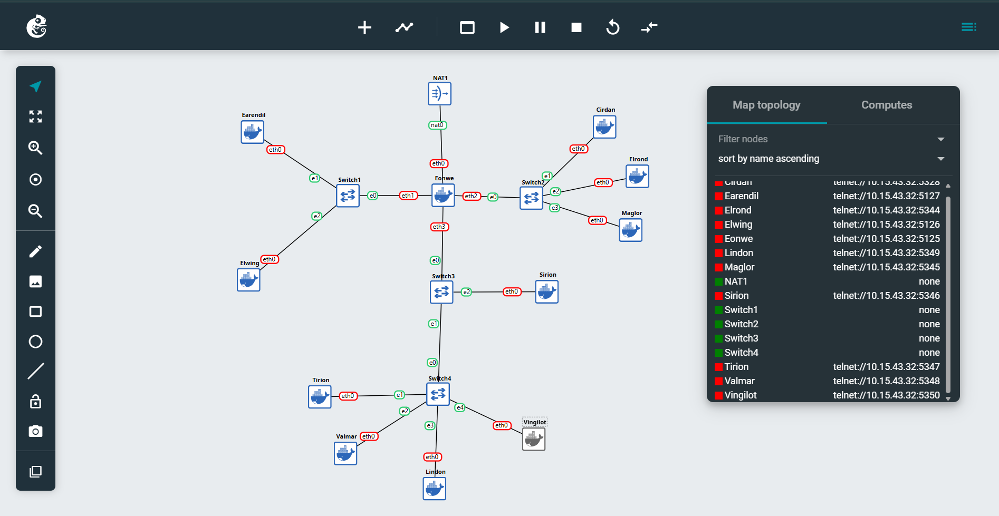

# Laporan Resmi Praktikum Komunikasi Data dan Jaringan Komputer Modul 2

# Jarkom K22

## Member

| No  | Nama                   | NRP        |
| --- | ---------------------- | ---------- |
| 1   | Kanafira Vanesha Putri | 5027241010 |
| 2   | Reza Aziz Simatupang   | 5027241051 |

## Reporting

1. Membuat topologi Jaringan dan Config Node
   
2. Konfigurasi NAT dan Konektivitas Internet

   - Pada node eonwe
   <pre>
       iptables -t nat -A POSTROUTING -o eth0 -j MASQUERADE -s 192.222.0.0/16
       echo 1 > /proc/sys/net/ipv4/ip_forward
   </pre>

3. Konfigurasi Routing Internal dan DNS Resolver

   - Pada node selain eonwe
   <pre>
       apt update
       echo nameserver 192.168.122.1 > /etc/resolv.conf
   </pre>

4. Para penjaga nama naik ke menara, di Tirion (ns1/master) bangun zona <xxxx>.com sebagai authoritative dengan SOA yang menunjuk ke ns1.<xxxx>.com dan catatan NS untuk ns1.<xxxx>.com dan ns2..com. Buat A record untuk ns1.<xxxx>.com dan ns2.<xxxx>.com yang mengarah ke alamat Tirion dan Valmar sesuai glosarium, serta A record apex <xxxx>.com yang mengarah ke alamat Sirion (front door), aktifkan notify dan allow-transfer ke Valmar, set forwarders ke 192.168.122.1. Di Valmar (ns2/slave) tarik zona <xxxx>.com dari Tirion dan pastikan menjawab authoritative. pada seluruh host non-router ubah urutan resolver menjadi ns1.<xxxx>.com → ns2.<xxxx>.com → 192.168.122.1. Verifikasi query ke apex dan hostname layanan dalam zona dijawab melalui ns1/ns2.

   - Tirion
     <pre>
         apt update
         apt install bind9 -y
         ln -s /etc/init.d/named /etc/init.d/bind9
     </pre>
     <pre>
         cat <<EOF > /etc/bind/named.conf.options
         options {
             directory "/var/cache/bind";
     
             forwarders {
                 192.168.122.1;
         };
     
             allow-query { any; };
             auth-nxdomain no;
             listen-on { any; };
             listen-on-v6 { any; };
         };
     
         EOF
     </pre>
     <pre>
         mkdir -p /etc/bind/k22 && cat <<EOF > /etc/bind/k22/k22.com
         \$TTL    604800          ; Waktu cache default (detik)
         @       IN      SOA     ns1.k22.com. root.k22.com. (
                                 2025100401 ; Serial (format YYYYMMDDXX)
                                 604800     ; Refresh (1 minggu)
                                 86400      ; Retry (1 hari)
                                 2419200    ; Expire (4 minggu)
                                 604800 )   ; Negative Cache TTL
     
         @        IN      NS     ns1.k22.com.
         @        IN      NS     ns2.k22.com.
     
         ns1     IN       A      10.91.3.3
         ns2     IN       A      10.91.3.4
     
         @       IN       A      10.91.3.2
     
         EOF
     </pre>
     <pre>
         cat <<EOF > /etc/bind/named.conf.local
         zone "k22.com" {
             type master;
             file "/etc/bind/k22/k22.com";
             allow-transfer { 10.91.3.4; };
             notify yes;
         };
     
         EOF
     </pre>
     <pre>
         service bind9 restart
     </pre>
     <pre>
         echo "nameserver 10.91.3.3" > /etc/resolv.conf
         echo "nameserver 10.91.3.4" >> /etc/resolv.conf
         echo "nameserver 192.168.122.1" >> /etc/resolv.conf
     </pre>
     <pre>
         dig @localhost k22.com
     </pre>

   - Valmar
     <pre>
         apt update
         apt install bind9 -y
         ln -s /etc/init.d/named /etc/init.d/bind9
     </pre>
     <pre>
         cat <<EOF > /etc/bind/named.conf.options
         options {
             directory "/var/cache/bind";
     
             forwarders {
                 192.168.122.1;
         };
     
             allow-query { any; };
             auth-nxdomain no;
             listen-on { any; };
             listen-on-v6 { any; };
         };
     
         EOF
     </pre>
     <pre>
         mkdir -p /var/lib/bind/k22 && chown bind:bind /var/lib/bind/k22 && cat <<EOF > /etc/bind/named.conf.local
         zone "k22.com" {
              type slave;
             masters { 10.91.3.3; };
             file "/var/lib/bind/k22/k22.com";
         };
     
         EOF
     </pre>
     <pre>
         service bind9 restart
     </pre>
     <pre>
         echo "nameserver 10.91.3.3" > /etc/resolv.conf
         echo "nameserver 10.91.3.4" >> /etc/resolv.conf
         echo "nameserver 192.168.122.1" >> /etc/resolv.conf
     </pre>

5. “Nama memberi arah,” kata Eonwe. Namai semua tokoh (hostname) sesuai glosarium, eonwe, earendil, elwing, cirdan, elrond, maglor, sirion, tirion, valmar, lindon, vingilot, dan verifikasi bahwa setiap host mengenali dan menggunakan hostname tersebut secara system-wide. Buat setiap domain untuk masing masing node sesuai dengan namanya (contoh: eru..com) dan assign IP masing-masing juga. Lakukan pengecualian untuk node yang bertanggung jawab atas ns1 dan ns2
   <pre>
       cat <<EOF >> /etc/bind/k22/k22.com
       earendil       IN       A      10.91.1.2
       elwing         IN       A      10.91.1.3
       cirdan         IN       A      10.91.2.2
       elrond         IN       A      10.91.2.3
       maglor         IN       A      10.91.2.4
       sirion         IN       A      10.91.3.2
       lindon         IN       A      10.91.3.5
       vingilot       IN       A      10.91.3.6
   
       EOF
   </pre>
   <pre>
       service bind9 restart
   </pre>

6. Lonceng Valmar berdentang mengikuti irama Tirion. Pastikan zone transfer berjalan, Pastikan Valmar (ns2) telah menerima salinan zona terbaru dari Tirion (ns1). Nilai serial SOA di keduanya harus sama

- Tirion
<pre>
   dig @10.91.3.3 k22.com SOA +short
</pre>

- Valmar
<pre>
   dig @10.91.3.4 k22.com SOA +short
</pre>

7. Peta kota dan pelabuhan dilukis. Sirion sebagai gerbang, Lindon sebagai web statis, Vingilot sebagai web dinamis. Tambahkan pada zona .com A record untuk sirion..com (IP Sirion), lindon..com (IP Lindon), dan vingilot..com (IP Vingilot). Tetapkan CNAME :

   - www.<xxxx>.com → sirion.<xxxx>.com,
   - static.<xxxx>.com → lindon.<xxxx>.com, dan
   - app.<xxxx>.com → vingilot.<xxxx>.com.

   Verifikasi dari dua klien berbeda bahwa seluruh hostname tersebut ter-resolve ke tujuan yang benar dan konsisten.
   <pre>
       cat <<EOF >> /etc/bind/k22/k22.com
       www       IN       CNAME      sirion.k22.com.
       static    IN       CNAME      lindon.k22.com.
       app       IN       CNAME      elrond.k22.com.
   
       EOF
   </pre>
   <pre>
       service bind9 restart
   </pre>

8. Setiap jejak harus bisa diikuti. Di Tirion (ns1) deklarasikan satu reverse zone untuk segmen DMZ tempat Sirion, Lindon, Vingilot berada. Di Valmar (ns2) tarik reverse zone tersebut sebagai slave, isi PTR untuk ketiga hostname itu agar pencarian balik IP address mengembalikan hostname yang benar, lalu pastikan query reverse untuk alamat Sirion, Lindon, Vingilot dijawab authoritative.

#### **Konfigurasi di Tirion (Master)**

Pertama, kami mendeklarasikan _reverse zone_ `3.91.10.in-addr.arpa` di file `/etc/bind/named.conf.local`.

```sh
cat <<EOF >> /etc/bind/named.conf.local
zone "3.91.10.in-addr.arpa" {
    type master;
    file "/etc/bind/k22/3.91.10.in-addr.arpa";
    allow-transfer { 10.91.3.4; };
};
EOF
```

Selanjutnya, kami membuat file _zone_-nya dan mengisinya dengan _record_ `PTR` untuk Sirion (`10.91.3.2`), Lindon (`10.91.3.5`), dan Vingilot (`10.91.3.6`).

```sh
cat <<EOF > /etc/bind/k22/3.91.10.in-addr.arpa
\$TTL    604800
@       IN      SOA     ns1.k22.com. root.k22.com. (
                        2025100401 ; Serial
                        604800     ; Refresh
                        86400      ; Retry
                        2419200    ; Expire
                        604800 )   ; Negative Cache TTL

@        IN      NS     ns1.k22.com.
@        IN      NS     ns2.k22.com.

2       IN       PTR    sirion.k22.com.
5       IN       PTR    lindon.k22.com.
6       IN       PTR    vingilot.k22.com.
EOF
```

#### **Konfigurasi di Valmar (Slave)**

Di Valmar, kami mengkonfigurasinya sebagai _slave_ untuk _reverse zone_ yang sama, dengan menunjuk Tirion sebagai _master_.

```sh
cat <<EOF >> /etc/bind/named.conf.local
zone "3.91.10.in-addr.arpa" {
  type slave;
  masters { 10.91.3.3; };
  file "/var/lib/bind/k22/3.91.10.in-addr.arpa";
};
EOF
```

#### **Verifikasi**

Pengujian dilakukan dari klien **Earendil** menggunakan perintah:

```sh
host -t ptr 10.91.3.2
host -t ptr 10.91.3.5
host -t ptr 10.91.3.6
```

Hasil verifikasi menunjukkan bahwa setiap alamat IP berhasil dipetakan kembali ke _hostname_ yang sesuai, menandakan konfigurasi _Reverse DNS_ telah berhasil. 9. Lampion Lindon Dinyalakan (Web Server Statis)
_ Konfigurasi di Lindon
<pre>
apt update
apt install apache2 -y
mkdir -p /var/www/annals/
</pre>
<pre>
cat <<EOF > /etc/apache2/sites-available/000-default.conf
<VirtualHost _:80>
ServerAdmin webmaster@lindon.k22.com
DocumentRoot /var/www/annals
<Directory /var/www/annals>
Options +Indexes
AllowOverride None
Require all granted
</Directory>

            ErrorLog /var/log/apache2/error.log
            CustomLog /var/log/apache2/access.log combined
        </VirtualHost>
        EOF
    </pre>
    <pre>
        service apache2 restart
    </pre>

10. Vingilot mengisahkan cerita dinamis. Jalankan web dinamis (PHP-FPM) pada hostname app.<xxxx>.com dengan beranda dan halaman about, serta terapkan rewrite sehingga /about berfungsi tanpa akhiran .php. Akses harus dilakukan melalui hostname.
    - Konfigurasi di vingilot
      <pre>
          apt install apache2 php php8.4-fpm libapache2-mod-fcgid -y
      </pre>
      <pre>
          cat <<EOF > /etc/apache2/sites-available/000-default.conf
          <VirtualHost *:80>
              ServerAdmin webmaster@vingilot.k22.com
              DocumentRoot /var/www/html
              <Directory /var/www/html>
                  AllowOverride All
              </Directory>
              <FilesMatch \.php$>
                  SetHandler "proxy:unix:/var/run/php/php8.4-fpm.sock|fcgi://localhost/"
              </FilesMatch>
          </VirtualHost>
          EOF
      </pre>
11. Di muara sungai, Sirion berdiri sebagai reverse proxy. Terapkan path-based routing: /static → Lindon dan /app → Vingilot, sambil meneruskan header Host dan X-Real-IP ke backend. Pastikan Sirion menerima www..com (kanonik) dan sirion..com, dan bahwa konten pada /static dan /app di-serve melalui backend yang tepat.
    \*Konfigurasi di sirion
    <pre>
        apt update
        apt install nginx -y
    </pre>
    <pre>
        cat <<EOF > /etc/nginx/sites-available/default
        server {
            listen 80;
            server_name www.k22.com sirion.k22.com;
    
            proxy_set_header Host \$host;
            proxy_set_header X-Forwarded-For \$proxy_add_x_forwarded_for;
            proxy_set_header X-Real-IP \$remote_addr;
    
            location / {
                root /var/www/html;
                index index.html index.htm;
                try_files \$uri \$uri/ =404;
            }
    
            location /static/ {
                proxy_pass http://lindon.k22.com/;
            }
    
            location /app/ {
                proxy_pass http://vingilot.k22.com/;
            }
        }
        EOF
    </pre>
    <pre>
        service nginx restart
    </pre>

12. Membuat path admin pada node sirion, dan implementasi basic autentikasi (sirion)

    - install nginx dan apache
    <pre>
        apt-get install apache2-utils -y
        apt install nginx -y
    </pre>
    - add password
    <pre>
        htpasswd -c /etc/nginx/.htpasswd admin 
        cat /etc/nginx/.htpasswd 
    </pre>
    - edit nginx config
    <pre>
        nano /etc/nginx/sites-available/default
    </pre>
    - isi config
    <pre>
        server {
            listen 80;
            server_name www.K22.com sirion.K22.com;
    
            # ... konfigurasi lain yang sudah ada ...
    
            # Path untuk /static (sudah ada dari soal sebelumnya)
            location /static {
                proxy_pass http://192.222.3.5;
                proxy_set_header Host \$host;
                proxy_set_header X-Real-IP \$remote_addr;
            }
    
            # Path untuk /app (sudah ada dari soal sebelumnya)
            location /app {
                proxy_pass http://192.222.3.6;
                proxy_set_header Host \$host;
                proxy_set_header X-Real-IP \$remote_addr;
            }
    
            # Path untuk /admin dengan Basic Auth
            location /admin {
                auth_basic "Restricted Area";
                auth_basic_user_file /etc/nginx/.htpasswd;
                
                # Kamu bisa proxy ke backend tertentu atau serve konten statis
                # Contoh jika ingin serve konten statis:
                root /var/www/html;
                index index.html;
                
                # Atau jika ingin proxy ke backend:
                # proxy_pass http://<backend_server>;
                # proxy_set_header Host \$host;
                # proxy_set_header X-Real-IP \$remote_addr;
            }
        }
    </pre>

    - restart server
    <pre>
        service nginx restart
        service nginx status
    </pre>
    - verifikasi

13.
14.
15.
16.
17.
18.
19.
20.
